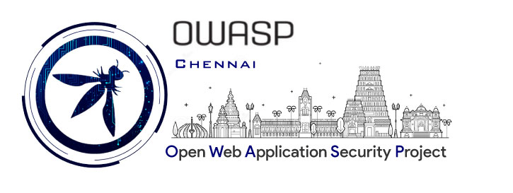
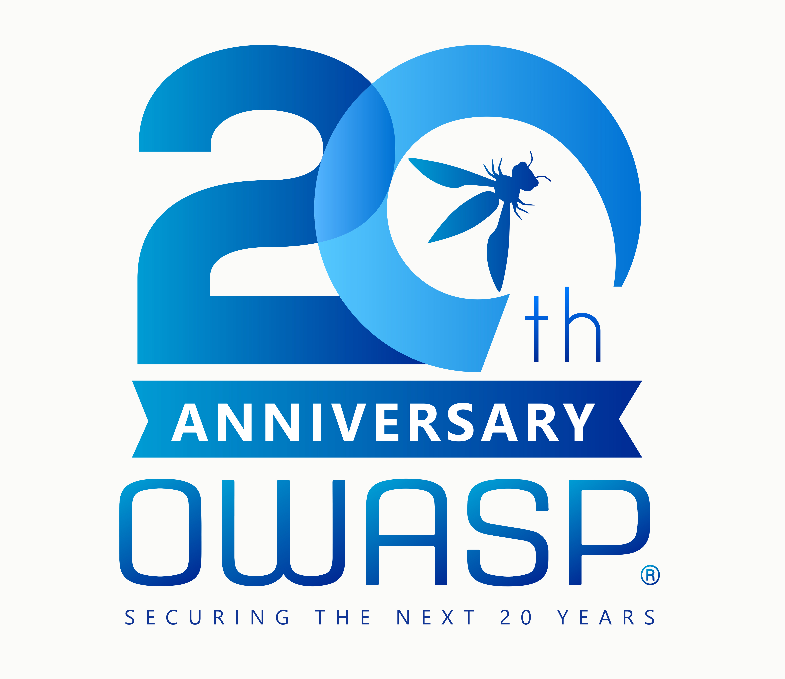

---

layout: col-sidebar
title: OWASP Chennai
tags: Chennai OWASP Chapter India
level: 6
meetup-group: Chennai-OWASP-Meetup-Group
country: India
region: Asia

---

## Welcome



OWASP Chennai was founded in Jan, 2009. For the past 11 years, the Chennai Chapter has conducted numerous Meetups, Webinars and Conferences. All these conferences are open meets where everyone can join and share their knowledge in Application Security. The chapter presents opportunities to the software community in contributing to secure application development.

## Participation
The Open Web Application Security Project (OWASP) is a nonprofit foundation that works to improve the security of software. All of our projects ,tools, documents, forums, and chapters are free and open to anyone interested in improving application security. 

Chapters are led by local leaders in accordance with the [Chapter Policy](https://owasp.org/www-policy/). Financial contributions should only be made online using the authorized online donation button. To be a SPEAKER at ANY OWASP Chapter in the world simply contact the local chapter leader with details of what OWASP Project, independent research, or related software security topic you would like to present.

Everyone is welcome and encouraged to participate in our [Projects](/projects), [Local Chapters](/chapters), [Events](/events), [Online Groups](https://groups.google.com/a/owasp.com/), and [Community Slack Channel](https://owasp.slack.com/). We especially encourage diversity in all our initiatives. OWASP is a fantastic place to learn about application security, to network, and even to build your reputation as an expert. We also encourage you to be [become a member](/membership) or consider a [donation](/donate) to support our ongoing work.

**OWASP Chennai proudly celebrating OWASP’s 20th Anniversary!**



```Switch to Speakers tab for more information on presenting your research or talk on OWASP Chennai Chapter```

## Upcoming Meetup Events


 
Follow us on Twitter to know about more upcoming events and instant updates
